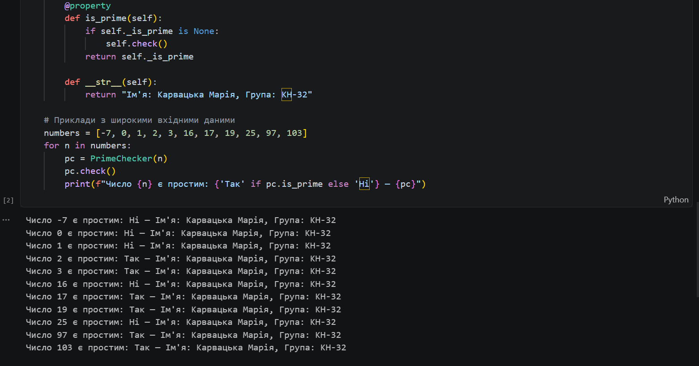

# Звіт до роботи

## Тема
Віртуальні середовища та використання принципів ООП

## Мета роботи
Навчитися використовувати основні принципи об’єктно-орієнтованого програмування (ООП), створювати класи, об’єкти, застосовувати наслідування, інкапсуляцію та поліморфізм, а також працювати з віртуальними середовищами.

## Виконання роботи

У ході роботи було:

- Створено абстрактний клас `Item` з методом `attack()`
- Реалізовано класи-нащадки:
  - `Sword`
  - `Axe`
- Використано:
  - **Наслідування** (класи `Sword` і `Axe` наслідують `Item`)
  - **Інкапсуляцію** (приватний атрибут `__attack_power`)
  - **Поліморфізм** (перевизначення методу `attack()`)
- Реалізовано взаємодію об’єктів (бій між предметами)
- Використано генерацію випадкових значень (`randint`)

## Приклад роботи програми

## Робота з віртуальними середовищами

- Активування та деактивування середовища:
  - `activate`
  - `deactivate`
- Використання інструментів:
  - `venv`
  - `pipenv`
  - `poetry`

## Висновок

❓ Так  
  
❓ Так  

❓ Так
 
❓ Ні  

❓ Так

❓ Так  
  
❓ Жодних