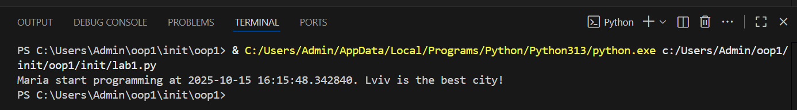
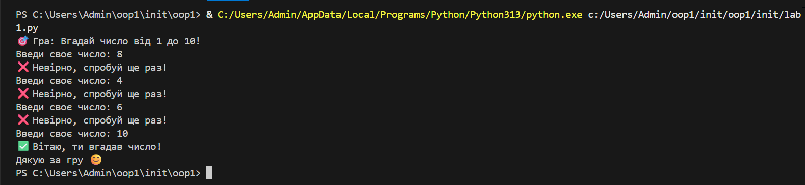

### Звіт до роботи
-----
### Тема: *Вступні заняття: налаштування середовища, початок роботи з Python* 
------
### Мета: *Налаштуйте середовище роботи VS Code, створити репозиторій Github та налаштувати інтеграцію з ним, написати першу програму на Python та створити звіт з використанням форматування Markdown*

---
### Виконання роботи:
* Результвти виконання завданнь: 

1. Створити заготовку до звіту та перші файли Python для написання програм;
1. Доінсталювали плагіни та почали працювати з VScode;
1. Запитали в AI про першу програму;

- Запустили програму за допомогою Run

- Запустили програму з консолі 


4. Зробили ноутбук та запустили першу програму в комірках. Результати за посиланням [>>>>посилання<<<]

-*Вигляд виконаного коду*


*Попросили AI згенерувати програму, яка буде наступною:

``` Python 
import random

print("🎯 Гра: Вгадай число від 1 до 10!")

number = random.randint(1, 10)  # загадуємо число

while True:
    guess = int(input("Введи своє число: "))

    if guess == number:
        print("✅ Вітаю, ти вгадав число!")
        break  # вихід із циклу
    else:
        print("❌ Невірно, спробуй ще раз!")

print("Дякую за гру 😊")

```

-----
### Висновок

- :question: Що зроблено  в роботі :

*Налаштувала середовище, почала роботу з Python*

Що зроблено в роботі;

- :question: Чи досягнуто мети роботи;

*Так

- :question: Які нові знання отримано;

* Як правильно налаштовувати  середовище і інсталювати 
плагіни, також новий досвід з Python

- :question: Чи вдалось відповісти на всі питання задані в ході роботи;

*Так

- :question: Чи вдалося виконати всі завдання;

- :question: Чи виникли складності у виконанні завдання;

*Так, але я з ними впоралась

- :question: Чи подобається такий формат здачі роботи (Feedback);

* Так. це новий досвіт, також зручніше ніж в GoogleDocument n

- :question: Побажання для покращення (Suggestions);

*Побажань немає


